# ChampionBook

## Processo de Desenvolvimento

-   [Instalações | Configurações | Testes](#instalações--configurações--testes)
-   [Criação de Mock | Tipagem | Importações](#criação-de-mock--tipagem--importações)
-   [GET](#get)
    -   [getAllChampions](#➛-getallchampions)
    -   [getChampionsByName](#➛-getchampionsbyname)
-   [POST](#post)
    -   [createChampion](#➛-createchampion)
-   [DELETE](#delete)
    -   [deleteChampById](#➛-deletechampbyid)
-   [PUT](#put)
    -   [editChampionById](#➛-editchampionbyid)
-   [Estrutura Final](#estrutura-final)

## Instalações | Configurações | Testes

`terminal`

-   Para _criar_ o `package.json`:

    ```bash
    npm init -y
    ```

-   Para _instalar_ o `typescript` e a sua tipagem:

    ```bash
    npm install -D typescript @types/node
    ```

-   Para criar o _arquivo_ `tsconfig.json`:

    ```bash
    npx tsc --init
    ```

-   Para instalar as duas _libs_ `express` e `cors`:

    ```bash
    npm i express cors
    ```

-   Para instalar as _devDependencies_ do `express` e do `cors`:

    ```bash
    npm i @types/express @types/cors ts-node-dev -D
    ```

`package.json`

-   Criando os `scripts`:
    ```json
    "start": "node build/index.js",
    "dev": "ts-node-dev src/index.ts",
    ```

`index.ts`

-   Criei uma pasta `src` e dentro dela um arquivo chamado `index.ts`, `database.ts`, `types.ts`.

-   Colei o seguinte código no `index.ts`:

    ```ts
    import express, { Request, Response } from 'express';
    import cors from 'cors';

    const app = express();

    app.use(express.json());
    app.use(cors());

    app.listen(3003, () => {
        console.log('Servidor rodando na porta 3003');
    });

    app.get('/test', (req: Request, res: Response) => {
        res.send('Funcionando!');
    });
    ```

-   Criei o endpoint correspondente no `Postman`

    -   Collections ➛ + ➛ Blank collection ➛ rename 'champion-book' ➛ Add Request ➛ rename 'test'

    -   Com o método `GET` e url `http://localhost:3003/test` obtive a mensagem 'Funcionando!'

    -   Imagem do Postman:
        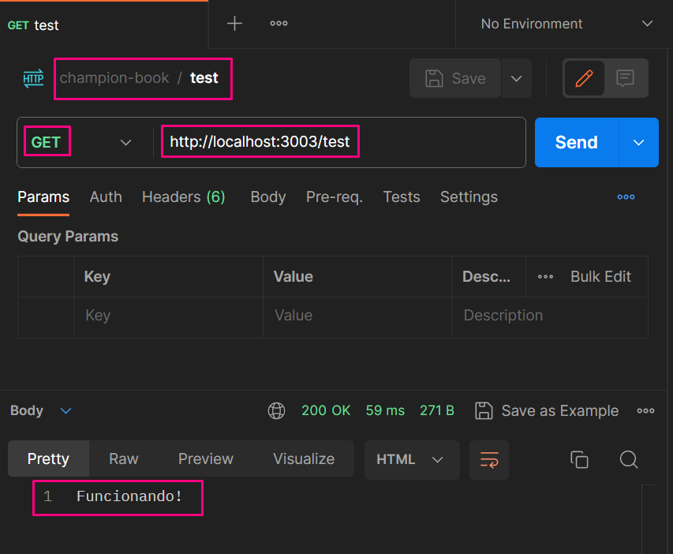

## Criação de Mock | Tipagem | Importações

Criação da tipagem:

`types.ts`

```ts
export enum DIFFICULTY {
    EASY = 'Fácil',
    MEDIUM = 'Médio',
    HARD = 'Difícil',
}

export type TChampion = {
    id: number;
    name: string;
    img: string;
    attack: number;
    defense: number;
    magic: number;
    difficulty: DIFFICULTY;
};
```

Importação da tipagem e aplicação nos dados:

`database.ts`

```ts
import { DIFFICULTY, TChampion } from './types';

export const champions: TChampion[] = [
    {
        id: 1,
        name: 'Morgana',
        img: 'morgana.jpg',
        attack: 2,
        defense: 6,
        magic: 8,
        difficulty: DIFFICULTY.EASY,
    },
    {
        id: 2,
        name: 'Leona',
        img: 'leona.jpg',
        attack: 4,
        defense: 8,
        magic: 3,
        difficulty: DIFFICULTY.MEDIUM,
    },
    {
        id: 3,
        name: 'Nami',
        img: 'nami.jpg',
        attack: 4,
        defense: 3,
        magic: 7,
        difficulty: DIFFICULTY.MEDIUM,
    },
    {
        id: 4,
        name: 'Braum',
        img: 'braum.jpg',
        attack: 3,
        defense: 9,
        magic: 4,
        difficulty: DIFFICULTY.EASY,
    },
    {
        id: 5,
        name: 'Lulu',
        img: 'lulu.jpg',
        attack: 4,
        defense: 5,
        magic: 7,
        difficulty: DIFFICULTY.MEDIUM,
    },
    {
        id: 6,
        name: 'Rakan',
        img: 'rakan.jpg',
        attack: 2,
        defense: 4,
        magic: 8,
        difficulty: DIFFICULTY.MEDIUM,
    },
    {
        id: 7,
        name: 'Yuumi',
        img: 'yuumi.jpg',
        attack: 1,
        defense: 2,
        magic: 9,
        difficulty: DIFFICULTY.EASY,
    },
    {
        id: 8,
        name: 'Alistar',
        img: 'alistar.jpg',
        attack: 3,
        defense: 9,
        magic: 5,
        difficulty: DIFFICULTY.HARD,
    },
    {
        id: 9,
        name: 'Zyra',
        img: 'zyra.jpg',
        attack: 4,
        defense: 3,
        magic: 8,
        difficulty: DIFFICULTY.HARD,
    },
    {
        id: 10,
        name: 'Nautilus',
        img: 'nautilus.jpg',
        attack: 4,
        defense: 6,
        magic: 6,
        difficulty: DIFFICULTY.MEDIUM,
    },
];
```

Importação dos dados e visualização no console:

`index.ts`

```ts
(...)

import { champions } from './database';

(...)

console.table(champions);

(...)
```

## GET

### ➛ getAllChampions

`index.ts`

```ts
// getAllChampions
app.get('/champions', (req: Request, res: Response) => {
    const result: TChampion[] = champions;
    res.status(200).send(result);
});
```

`Postman`<br>

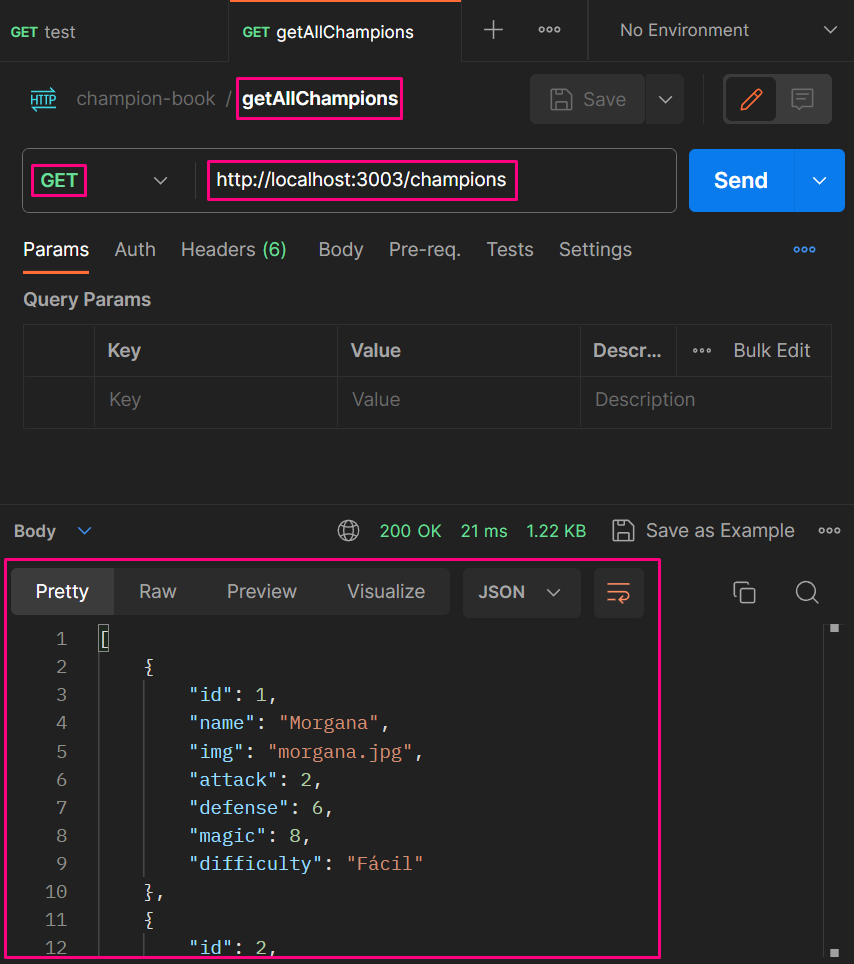

### ➛ getChampionsByName

#### SEM `Query`

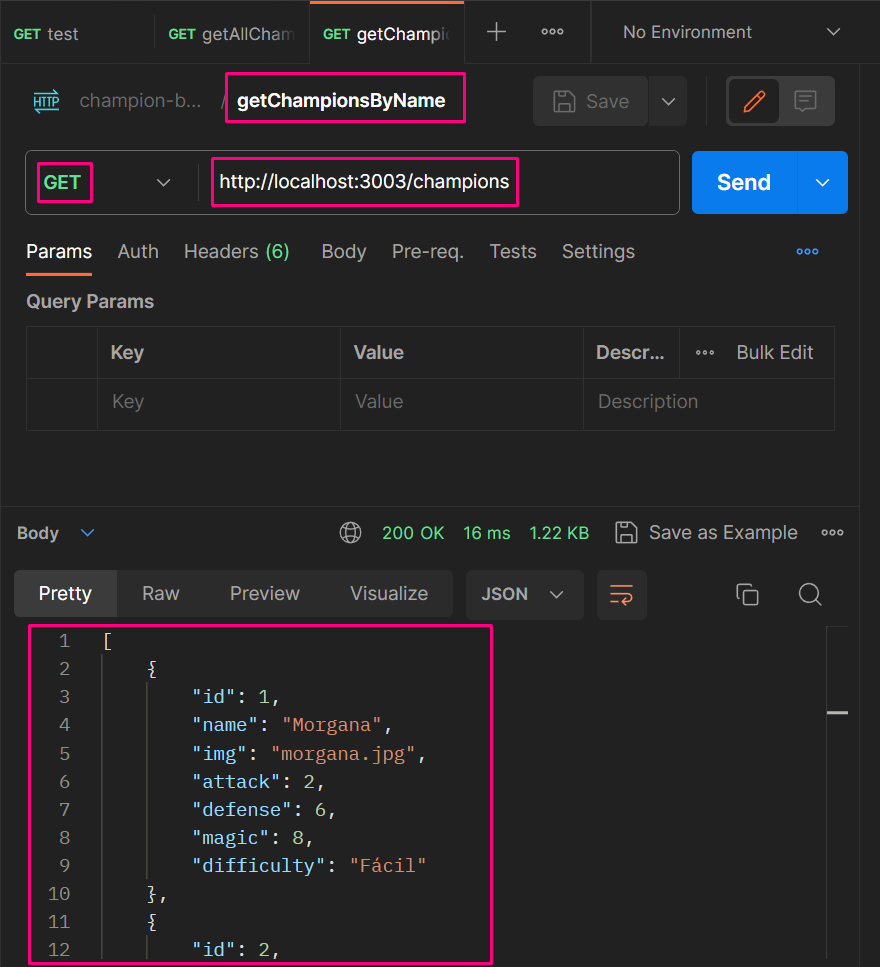

#### COM `Query`

> ATENÇÃO: É preciso comentar a função acima para poder rodar essa

`index.ts`

```ts
// getAllChampions
// app.get('/champions', (req: Request, res: Response) => {
//     const result: TChampion[] = champions;
//     res.status(200).send(result);
// });

// getChampionsByName
app.get('/champions', (req: Request, res: Response) => {
    const query: string = req.query.q as string;
    // console.log(query);
    if (query !== undefined) {
        const championsByName: TChampion[] = champions.filter((champion) =>
            champion.name.toLowerCase().includes(query.toLowerCase())
        );
        if (championsByName.length <= 0) {
            res.status(404).send('Nenhum produto encontrado');
        } else {
            res.status(200).send(championsByName);
        }
    } else {
        res.status(200).send(champions);
    }
});
```

`Postman`<br>

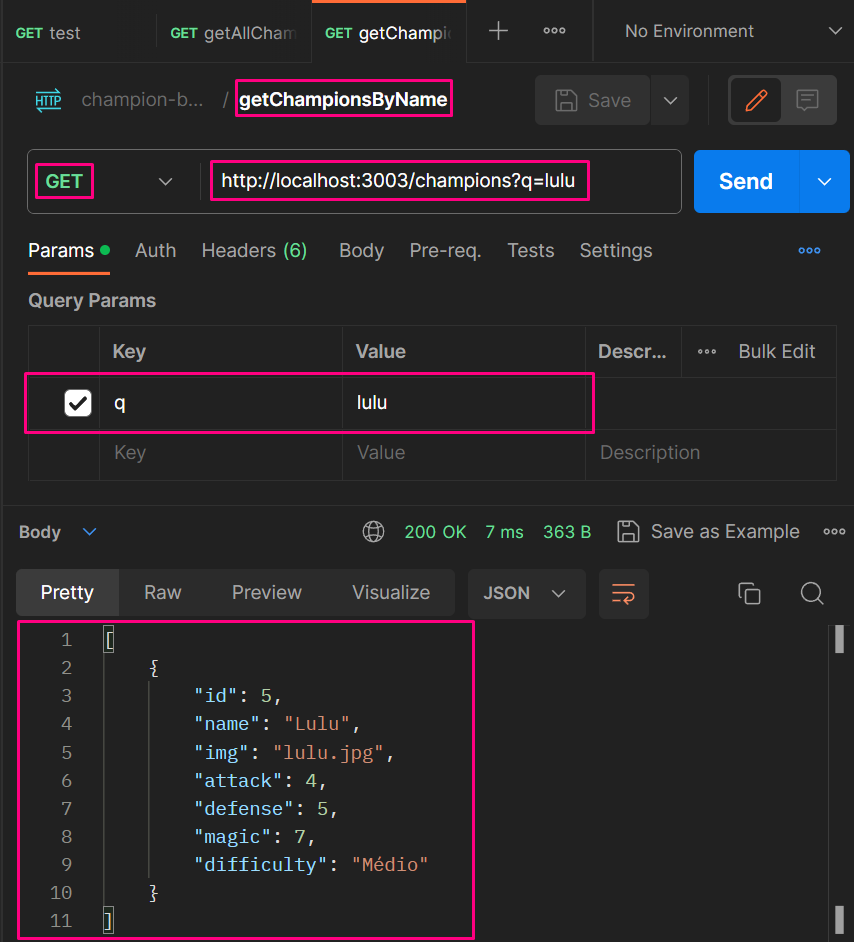

## POST

### ➛ createChampion

`index.ts`

```ts
// createChampion
app.post('/champions', (req: Request, res: Response) => {
    const { id, name, img, attack, defense, magic, difficulty }: TChampion =
        req.body;
    const newChamp: TChampion = {
        id,
        name,
        img,
        attack,
        defense,
        magic,
        difficulty,
    };
    champions.push(newChamp);
    res.status(201).send('Cadastro realizado com sucesso');
});
```

`Postman` <br>

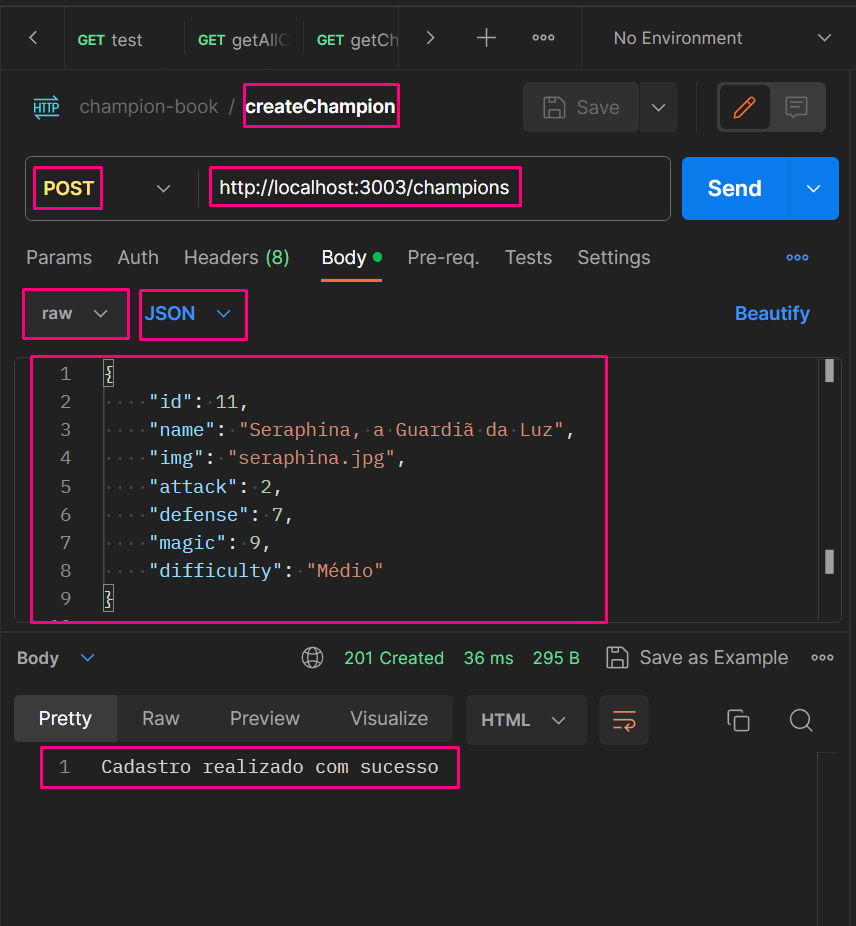

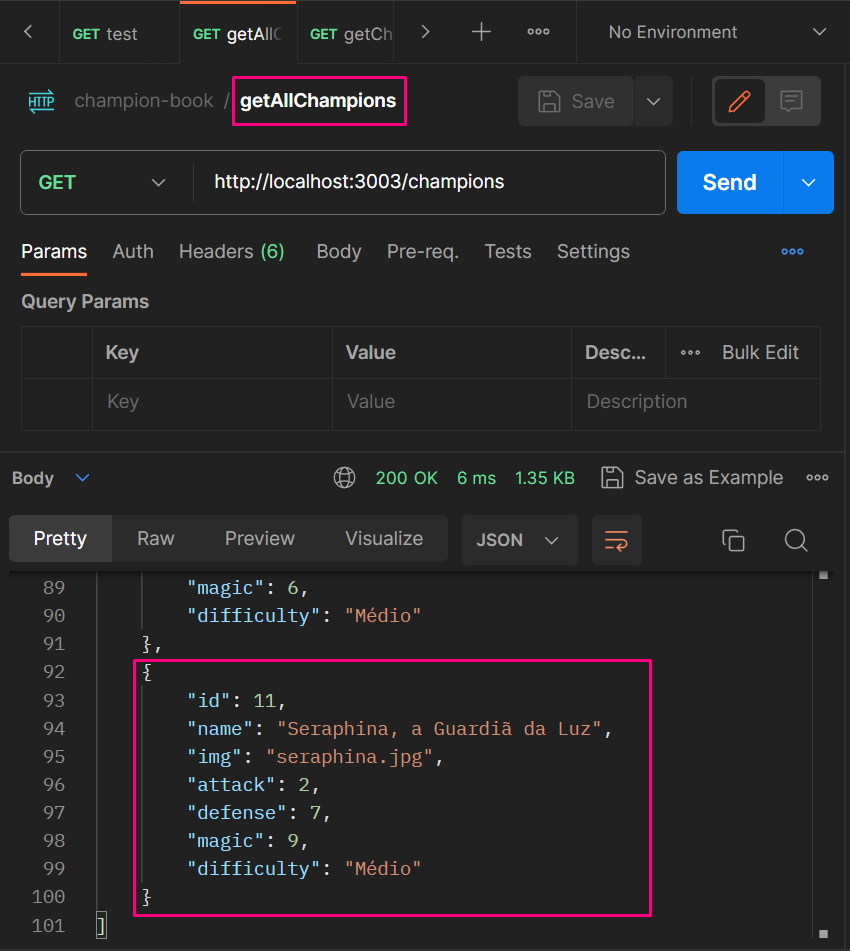

## DELETE

### ➛ deleteChampById

`index.ts`

```ts
// deleteChampById
app.delete('/champions/:id', (req: Request, res: Response) => {
    const id = req.params.id;
    const indexToDelete = champions.findIndex(
        (champion) => champion.id === Number(id)
    );
    if (indexToDelete >= 0) {
        champions.splice(indexToDelete, 1);
    } else {
        console.log(`O id ${id} não existe`);
    }
    res.status(200).send({
        message: `Campeão apagado com sucesso`,
    });
});
```

`Postman`<br>
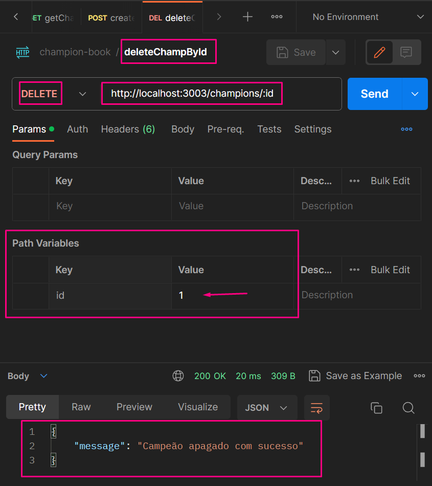

<br>

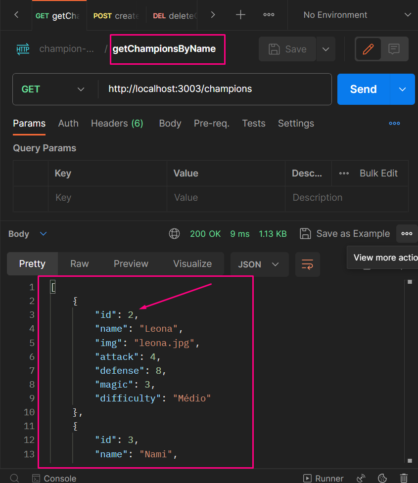

## PUT

### ➛ editChampionById

`index.ts`

```ts
// editChampionById
app.put('/champions/:id', (req: Request, res: Response) => {
    const id = req.params.id;
    const newId = req.body.id as number | undefined;
    const newName = req.body.name as string | undefined;
    const newImg = req.body.img as string | undefined;
    const newAttack = req.body.attack as number | undefined;
    const newDefense = req.body.defense as number | undefined;
    const newMagic = req.body.magic as number | undefined;
    const newDifficulty = req.body.difficulty as DIFFICULTY | undefined;
    const champion = champions.find((champion) => champion.id === Number(id));

    if (champion) {
        champion.id = newId || Number(champion.id);
        champion.name = newName || champion.name;
        champion.img = newImg || champion.img;
        champion.attack = newAttack || champion.attack;
        champion.defense = newDefense || champion.defense;
        champion.magic = newMagic || champion.magic;
        champion.difficulty = newDifficulty || champion.difficulty;
    }

    res.status(200).send({ message: 'Atualização realizada com sucesso' });
});
```

`Postman`<br>
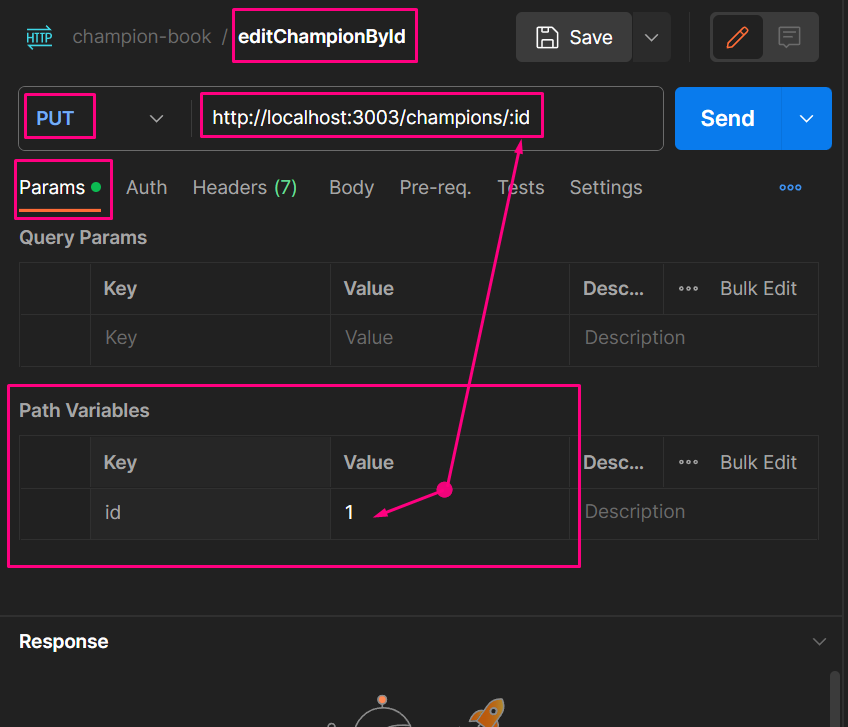

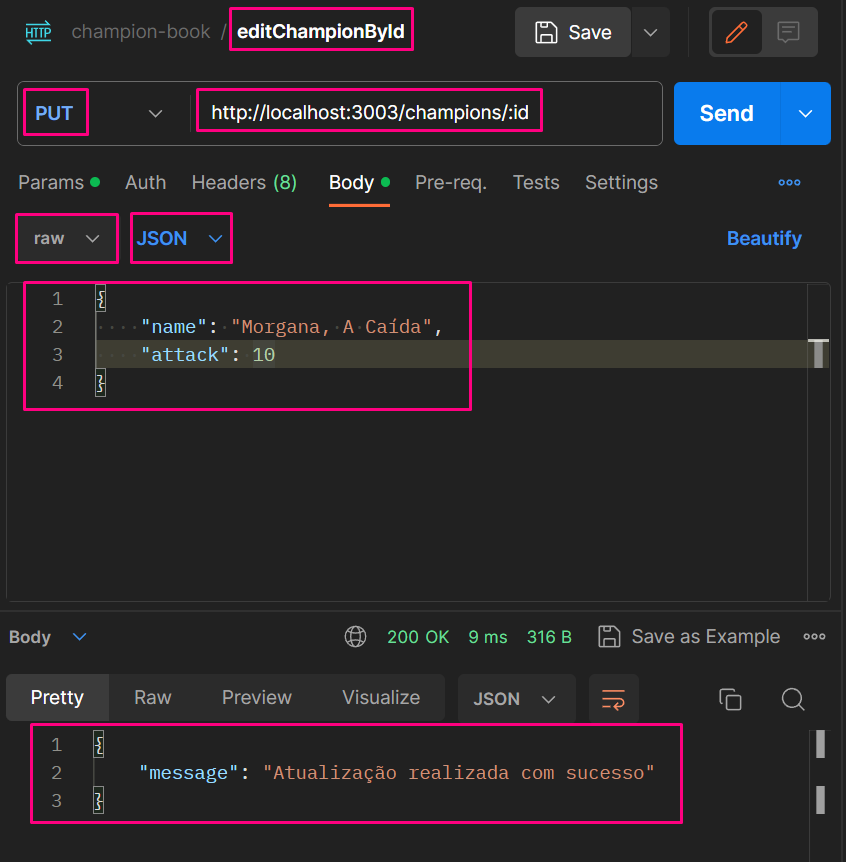

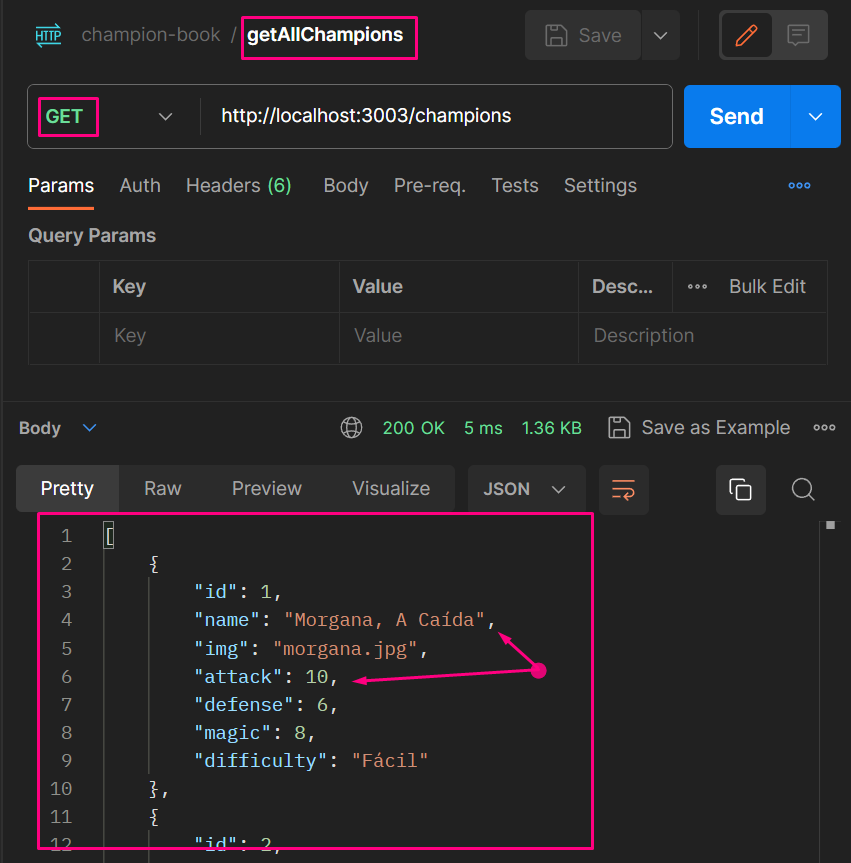

## Estrutura Final

### `index.ts` completo e coleção do `Postman`

`index.ts`

```ts
import express, { Request, Response } from 'express';
import cors from 'cors';
import { champions } from './database';
import { DIFFICULTY, TChampion } from './types';

const app = express();

app.use(express.json());
app.use(cors());

app.listen(3003, () => {
    console.log('Servidor rodando na porta 3003');
});

app.get('/test', (req: Request, res: Response) => {
    res.send('Funcionando!');
});

// console.table(champions);

// getAllChampions
// app.get('/champions', (req: Request, res: Response) => {
//     const result: TChampion[] = champions;
//     res.status(200).send(result);
// });

// getChampionsByName
app.get('/champions', (req: Request, res: Response) => {
    const query: string = req.query.q as string;
    // console.log(query);
    if (query !== undefined) {
        const championsByName: TChampion[] = champions.filter((champion) =>
            champion.name.toLowerCase().includes(query.toLowerCase())
        );
        if (championsByName.length <= 0) {
            res.status(404).send('Nenhum produto encontrado');
        } else {
            res.status(200).send(championsByName);
        }
    } else {
        res.status(200).send(champions);
    }
});

// createChampion
app.post('/champions', (req: Request, res: Response) => {
    const { id, name, img, attack, defense, magic, difficulty }: TChampion =
        req.body;
    const newChamp: TChampion = {
        id,
        name,
        img,
        attack,
        defense,
        magic,
        difficulty,
    };
    champions.push(newChamp);
    res.status(201).send('Cadastro realizado com sucesso');
});

// deleteChampById
app.delete('/champions/:id', (req: Request, res: Response) => {
    const id = req.params.id;
    const indexToDelete = champions.findIndex(
        (champion) => champion.id === Number(id)
    );
    if (indexToDelete >= 0) {
        champions.splice(indexToDelete, 1);
    } else {
        console.log(`O id ${id} não existe`);
    }
    res.status(200).send({
        message: `Campeão apagado com sucesso`,
    });
});

// editChampionById
app.put('/champions/:id', (req: Request, res: Response) => {
    const id = req.params.id;
    const newId = req.body.id as number | undefined;
    const newName = req.body.name as string | undefined;
    const newImg = req.body.img as string | undefined;
    const newAttack = req.body.attack as number | undefined;
    const newDefense = req.body.defense as number | undefined;
    const newMagic = req.body.magic as number | undefined;
    const newDifficulty = req.body.difficulty as DIFFICULTY | undefined;
    const champion = champions.find((champion) => champion.id === Number(id));

    if (champion) {
        champion.id = newId || Number(champion.id);
        champion.name = newName || champion.name;
        champion.img = newImg || champion.img;
        champion.attack = newAttack || champion.attack;
        champion.defense = newDefense || champion.defense;
        champion.magic = newMagic || champion.magic;
        champion.difficulty = newDifficulty || champion.difficulty;
    }

    res.status(200).send({ message: 'Atualização realizada com sucesso' });
});
```

`Postman`<br>
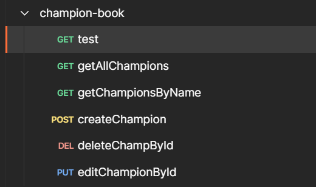
